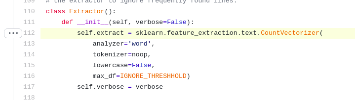
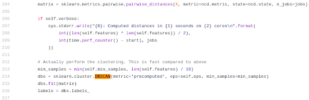
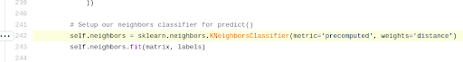
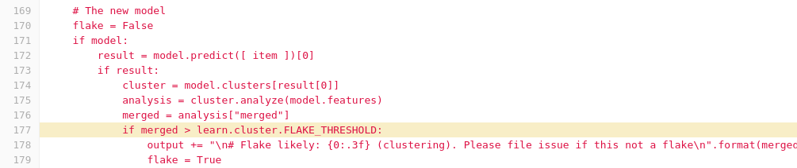

# Flake for QE - Short summary from project hand off

## Goal
The goal for this project is for the AI CoE team to help the QE team integrate flake classification into their reportportal tool, and ideally the existing flake analysis tool in the AI Library (or a similar implementation). The first step that needs to be accomplished is to take an existing dataset and run it through an existing implementation to see if it will work as is, and discover any data or ML problems that need to be overcome to complete the project.    

## Existing Implementations 

The first two links below contain the existing code in the AI Library repository for training and prediction of the current flake analysis implementation. The next link is the current AI Library and flake analysis service. And the last link is the repo for the Cockpit Project which contains the original implementation if this flake analysis. 

**Code Base**

[https://gitlab.com/opendatahub/ai-library/-/tree/master/flakes_train](https://gitlab.com/opendatahub/ai-library/-/tree/master/flakes_train) 
[https://gitlab.com/opendatahub/ai-library/tree/master/flakes_predict](https://gitlab.com/opendatahub/ai-library/tree/master/flakes_predict)

**AI Library**

[https://ui-ai-library.10.16.208.2.nip.io/home](https://ui-ai-library.10.16.208.2.nip.io/home)

**Other Projects**

[Cockpit Flake Implementation](https://github.com/cockpit-project/cockpituous/tree/208a7be38ab89c14b152127ec679d3627512a267/learn)

## How Does The Current Implementation Work?

### The Data

**Data Format:**

The input data should be in a jsonl format, where each record in the input is a separate line. Please see [test-example.jsonl.gz](https://github.com/cockpit-project/cockpituous/blob/208a7be38ab89c14b152127ec679d3627512a267/learn/test-example.jsonl.gz). The following fields are required:

*   "status": String value of `"failure"`, `"success"`, `"error"` or `"skip"`
*   "test": Name of the test
*   "log": The full textual log of the test

**Generating Data:**

This merged PR indicates that there may be an automated way of producing a viable labeled training dataset:

[https://github.com/cockpit-project/cockpit/pull/7349](https://github.com/cockpit-project/cockpit/pull/7349)

**Sample Data:**

Currently, there is a sample of QE data available for us to test out that was collected from the RHV product. It can be found in the datahub ceph bucket `s3://DH-PLAYEN/ccit/`. For additional instructions on how to access this dataset, please see the datahub ceph interaction [documentation](https://help.datahub.redhat.com/docs/tutorial-datascience-1-ceph). 

### ML Process:

Given a JSONL file in the form outlined above. We do the following:  

Use sklearn CountVectorizer to convert the log message into a 1xN vector where each position represents a word in the vocabulary and each value is the number of times that word occurred in the log message.  

[https://github.com/cockpit-project/cockpituous/blob/208a7be38ab89c14b152127ec679d3627512a267/learn/extractor.py#L112](https://github.com/cockpit-project/cockpituous/blob/208a7be38ab89c14b152127ec679d3627512a267/learn/extractor.py#L112) 

Then we use DBSCAN with a normalized compression distance (ncd) to cluster our training dataset.

[https://github.com/cockpit-project/cockpituous/blob/208a7be38ab89c14b152127ec679d3627512a267/learn/cluster.py#L204-L216](https://github.com/cockpit-project/cockpituous/blob/208a7be38ab89c14b152127ec679d3627512a267/learn/cluster.py#L204-L216) 

K-nearest neighbor is then used for prediction to determine which class a new test log belongs to.

[https://github.com/cockpit-project/cockpituous/blob/208a7be38ab89c14b152127ec679d3627512a267/learn/cluster.py#L242](https://github.com/cockpit-project/cockpituous/blob/208a7be38ab89c14b152127ec679d3627512a267/learn/cluster.py#L242) 

**How is a Flake determined?** I believe its a function of the cluster's merge percent. If a point is labeled as failed, they then use KNN to figure out which cluster it belongs to, and if it’s matched with a cluster that has a merge percent higher than the flake threshold  manually set in cluster.py, then it is labeled as a flake.   

[https://gitlab.com/opendatahub/ai-library/-/blob/master/flakes_train/bots/learn/cluster.py#L112](https://gitlab.com/opendatahub/ai-library/-/blob/master/flakes_train/bots/learn/cluster.py#L112)

[https://gitlab.com/opendatahub/ai-library/-/blob/master/flakes_predict/bots/tests-policy#L177](https://gitlab.com/opendatahub/ai-library/-/blob/master/flakes_predict/bots/tests-policy#L177)

## Initial Dataset Results:
_Last Update: September 22,2019_

I've run the code and noticed a couple issues with the available RHV data:

* Of the ~14,000 tests provided, only 3,792 have non-empty log messages. (~15gb)
 
* Of the ~3,792 tests 0 (zero) have `item.get(“status”) == “failure”` which are the examples the model uses to train. In other words, the current state of the provided 15gb dataset contains no compatible examples. 

* The format of item[“date”] is an int, in epoch time,where this project is expecting a string. Very manageable issue, but just logging it here as well.    

* Note: This has a huge training time, of the 3,792 available tests, I limited it to only 100 while debugging and training 100 took 21.4 minutes on a machine with 32Gb memory. 

## Current Notes & Updates:

**Development Notes**: This readme will be updated regularly based on the live notes kept in a google doc that can be found [here](https://docs.google.com/document/d/1Q3GUNnz7BITSPW--G5vlabmm_xXwM8lrm7fMbd81Rrc/edit?usp=sharing).

**Meeting Notes**: As we continue to collaborate with the QE team we will keep our meeting notes up to date [here](https://docs.google.com/document/d/1UpNrUb4OR1FL_qSMPbVRjFpe2i0mfqcYdq7KmKQlEJA/edit?usp=sharing). 
